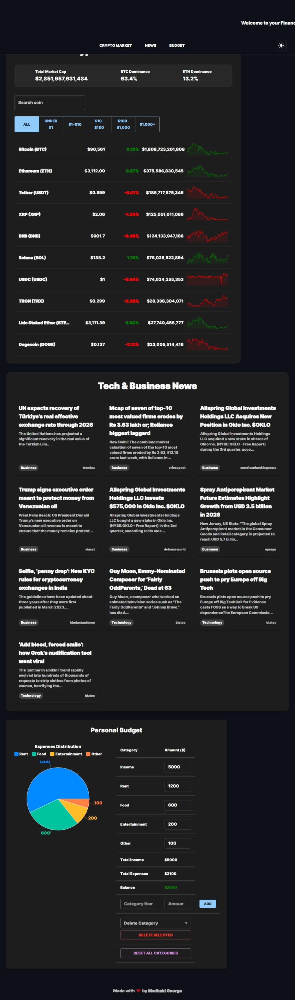
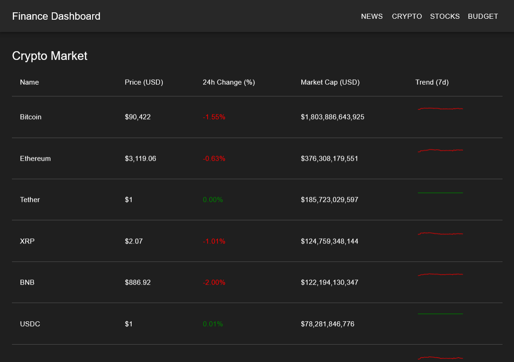
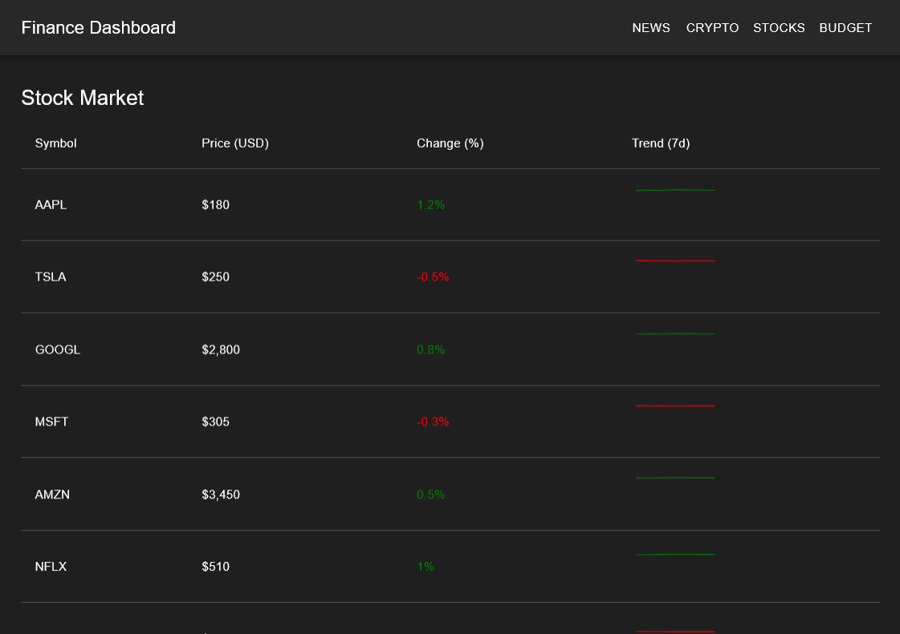
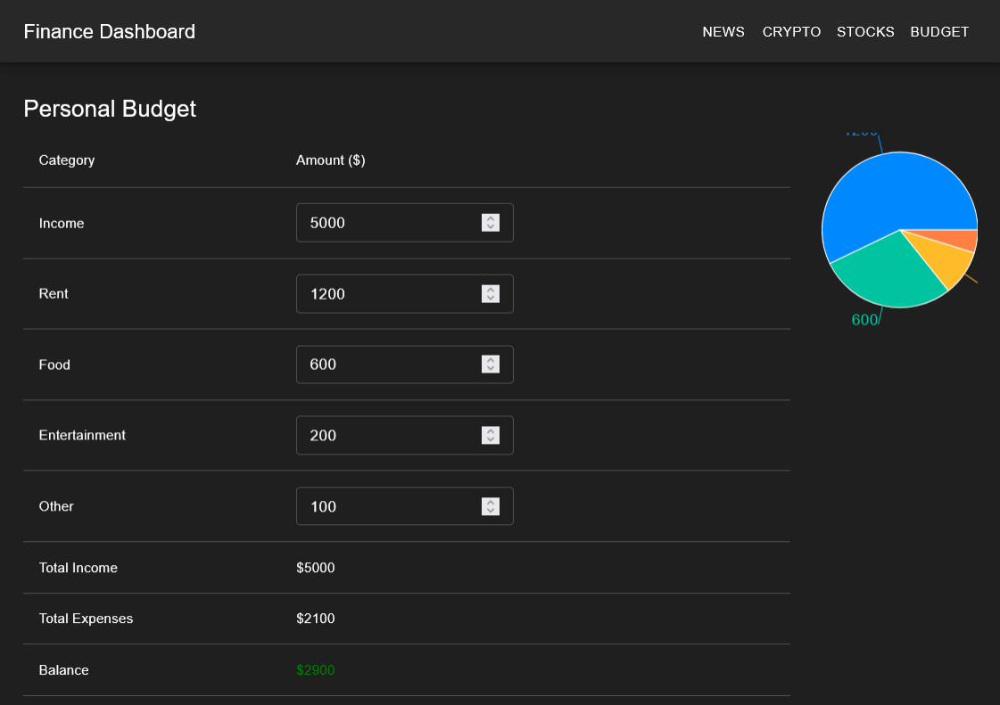

# Finance Dashboard

A modern, full-stack finance dashboard built with **React**, **Node.js**, **Express**, and **MongoDB**.  
The dashboard includes:

- Tech & Business News  
- Crypto Market Tracker  
- Stock Market Tracker  
- Personal Budget Tracker  

---

## **Features**

- Responsive layout with full-page sections for each module  
- Fixed navbar for easy navigation between sections  
- Crypto and Stock tables with market trends  
- Sleek and professional budget tracker  
- JWT-based authentication (login/signup)  
- Live news updates from NewsData.io  

---

## **Screenshots**

### News Section


### Crypto Market


### Stock Market


### Budget Tracker


> Replace the images above with your actual screenshots.

---

## **Getting Started**

### Prerequisites

- Node.js >= 18  
- npm >= 9  
- MongoDB Atlas account or local MongoDB  

---

### **1️⃣ Clone the repository**

```bash
git clone https://github.com/YOUR_USERNAME/finance-dashboard.git
cd finance-dashboard
